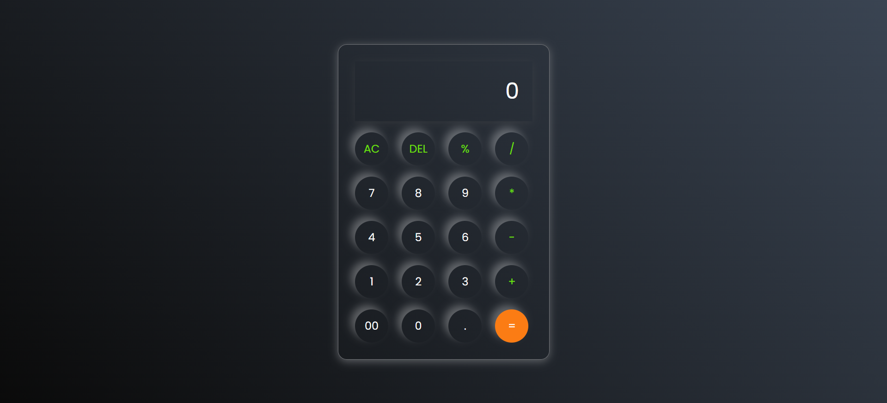

# Calculator Project

A simple calculator built using HTML, CSS, and JavaScript.

## Features
- Basic arithmetic operations (+, -, *, /, %)
- Prevents multiple operators
- Delete and Clear functionality
- Error handling

## Tech Stack
- HTML
- CSS
- JavaScript

## How to Run
Open index.html in your browser.

# Calculator Project

A simple calculator built using HTML, CSS, and JavaScript.

## Features
- Basic arithmetic operations (+, -, *, /, %)
- Delete and Clear functionality
- Error handling

## Tech Stack
- HTML
- CSS
- JavaScript

## How to Run
Open index.html in your browser.

## Live Demo
[Click here to use the calculator](https://ssnehatiwari21.github.io/Calculator/)

## Preview

